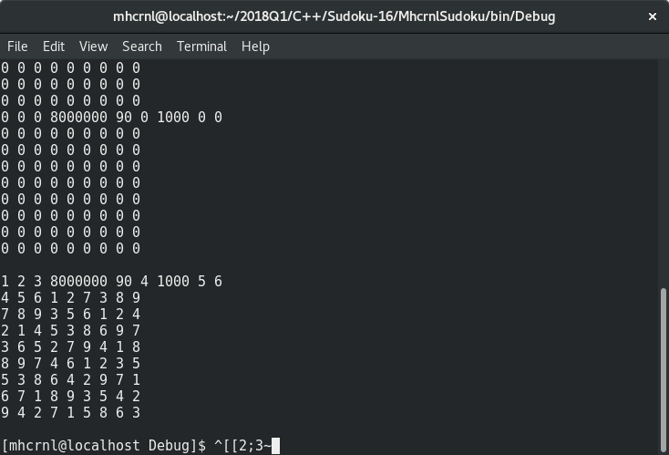

Sudoku Solver
=============

A c++ program that solves a sudoku puzzle.

Usage
-----
In MhcrnlSudoku is Code:Blocks project.

If input is from a file,

`$ ./solve puzzle-foo`

and if manual entry is preferred (the hardway),

`$ ./ solve`

followed by input of 81 (9x9) numbers

Input
-----

Input can either be a file containing the puzzle or user entry.
If a file is not given as argument, the program asks for user input.

Each cell/element in the input needs to be sperated by a space. The cells
without clues given should be given as 0s.

For example, a completely blank puzzle and a normal puzzle would like like:

    0 0 0 0 0 0 0 0 0

    0 0 0 0 0 0 0 0 0

    0 0 0 0 0 0 0 0 0

    0 0 0 0 0 0 0 0 0

    0 0 0 0 0 0 0 0 0

    0 0 0 0 0 0 0 0 0

    0 0 0 0 0 0 0 0 0

    0 0 0 0 0 0 0 0 0

    0 0 0 0 0 0 0 0 0
    
and 

	0 3 0 7 2 1 0 6 0

	2 0 5 4 0 0 0 3 1

	9 0 1 0 0 8 7 0 2

	5 0 0 0 3 7 1 9 0

	0 4 9 0 8 5 0 0 7

	7 1 0 9 0 0 3 5 0

	1 9 4 0 0 0 2 0 5

	0 2 7 5 1 0 0 0 3

	0 0 0 2 7 4 9 1 0

Logic
-----
Logic? Bruteforce! If there's a logic in bruteforce, that be it!

I'm not yet sure how backtracking is used, or what it actually means.
Also, no recursions were used in the code. I got the basic ideas from wikipedia,
which I shall quote here:

[Sudoku Algorithms - Solving Sudokus by a brute-force algorithm](http://en.wikipedia.org/wiki/Sudoku_algorithms#Solving_Sudokus_by_a_brute-force_algorithm)

> A brute force algorithm visits the empty cells in some order, filling in
> digits sequentially from the available choices, or backtracking
> (removing failed choices) when stymied. For the purposes of this exposition,
> a naive iteration order of left to right, top to bottom is assumed.

> Briefly, a brute force program would solve a puzzle by placing the digit "1"
> in the first cell and checking if it is allowed to be there. If there are no
> violations (checking row, column, and box constraints) then the algorithm
> advances to the next cell, and places a "1" in that cell. When checking
> for violations, it is discovered that the "1" is not allowed, so the value is
> advanced to a "2". If a cell is discovered where none of the 9 digits is
> allowed, then the algorithm leaves that cell blank and moves back to the
> previous cell. The value in that cell is then incremented by one. The
> algorithm is repeated until the allowed value in the 81st cell is discovered.
> The construction of 81 numbers is parsed to form the 9 x 9 solution matrix.

Performance
-----------
I hope I nailed it enough for a basic backtracker.

The hardest sudoku mentioned in the wikipedia article (and given as 
sample-puzzle-2-hard in repo) was solved in 1 minute and 12 seconds using a Pentium 4 2.66GHz processor
and in 45 seconds using a core i3 2.4GHz processor.
